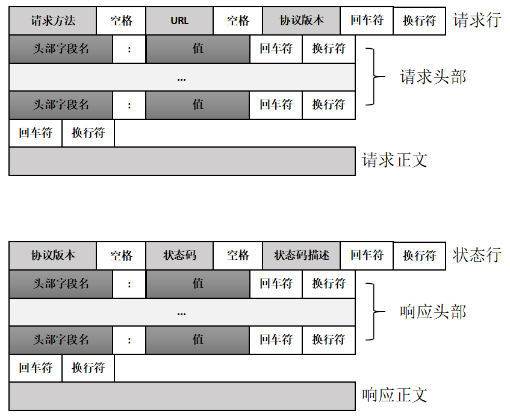
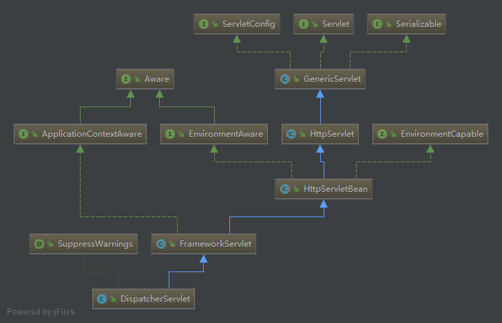

##Java中Http请求和响应的参数处理  

###HTTP 报文格式
  

**`Http`是属于应用层协议，本质上也还是走的`socket`通信。** 下面是一段基于 Java Socket 实现的 http 服务端 demo
```java
import java.io.BufferedReader;
import java.io.File;
import java.io.FileInputStream;
import java.io.IOException;
import java.io.InputStreamReader;
import java.io.PrintStream;
import java.net.ServerSocket;
import java.net.Socket;
import java.net.URLDecoder;
import java.util.StringTokenizer;

/**
 * Copyright:   Copyright 2007 - 2017 MPR Tech. Co. Ltd. All Rights Reserved.
 * Date:        2017年10月30日 上午15:56
 * Author:      zhangle
 * Version:     1.0.0.0
 * Description: Initialize
 */
public class HttpDemo implements Runnable {

    private final static int PORT = 28081;
    private ServerSocket server = null;

    public static void main(String[] args) {
        new HttpDemo();
    }

    public HttpDemo() {
        try {
            server = new ServerSocket(PORT);
            if (server == null)
                System.exit(1);
            new Thread(this).start();
        } catch (IOException e) {
            e.printStackTrace();
        }
    }

    public void run() {
        while (true) {
            try {
                Socket client = null;
                client = server.accept();
                if (client != null) {
                    try {
                        System.out.println("连接服务器成功！！...");

                        BufferedReader reader = new BufferedReader(
                                new InputStreamReader(client.getInputStream()));

                        // GET /test.jpg /HTTP1.1
                        String line = reader.readLine();

                        System.out.println("line: " + line);

                        String resource = line.substring(line.indexOf('/'),
                                line.lastIndexOf('/') - 5);

                        System.out.println("the resource you request is: "
                                + resource);

                        resource = URLDecoder.decode(resource, "UTF-8");

                        String method = new StringTokenizer(line).nextElement()
                                .toString();

                        System.out.println("the request method you send is: "
                                + method);

                        long contentLength = 0;
                        while ((line = reader.readLine()) != null) {
                            if (line.equals("")) {
                                break;
                            }
                            System.out.println("the Http Header is : " + line);
                            if (line.contains("Content-Length")) {
                                contentLength = Long.valueOf(line.split(":")[1].trim());
                            }
                        }

                        if ("post".equals(method.toLowerCase())) {
                            System.out.println("the post request body is: ");
                            char[] data = new char[1024 * 1024];
                            int length = -1;
                            int cLength = 0;
                            while (cLength < contentLength && (length = reader.read(data, 0, data.length)) != -1) {
                                String str = String.valueOf(data, 0, length);
                                System.out.println(str);
                                cLength += str.length();
                            }
                        }

                        if (resource.endsWith(".md")) {

                            transferFileHandle("./D-ServletRequest.md", client);
                            closeSocket(client);
                            continue;

                        } else {
                            PrintStream writer = new PrintStream(
                                    client.getOutputStream(), true);
                            writer.println("HTTP/1.0 404 Not found");// 返回应答消息,并结束应答
                            writer.println();// 根据 HTTP 协议, 空行将结束头信息
                            writer.close();
                            closeSocket(client);
                            continue;
                        }
                    } catch (Exception e) {
                        System.out.println("HTTP服务器错误:"
                                + e.getLocalizedMessage());
                    }
                }
            } catch (Exception e) {
                e.printStackTrace();
            }
        }
    }

    private void closeSocket(Socket socket) {
        try {
            socket.close();
        } catch (IOException ex) {
            ex.printStackTrace();
        }
        System.out.println(socket + "离开了HTTP服务器");
    }

    private void transferFileHandle(String path, Socket client) {

        File fileToSend = new File(path);

        if (fileToSend.exists() && !fileToSend.isDirectory()) {
            try {
                PrintStream writer = new PrintStream(client.getOutputStream());
                writer.println("HTTP/1.0 200 OK");// 返回应答消息,并结束应答
                writer.println("Content-Type:application/binary");
                writer.println("Content-Length:" + fileToSend.length());// 返回内容字节数
                writer.println();// 根据 HTTP 协议, 空行将结束头信息

                FileInputStream fis = new FileInputStream(fileToSend);
                byte[] buf = new byte[fis.available()];
                fis.read(buf);
                writer.write(buf);
                writer.close();
                fis.close();
            } catch (IOException e) {
                e.printStackTrace();
            }
        }
    }
}    
```  

-----   

###Servlet 
  **Java定义的开发模型，封装了一套规范的协议处理接口。** 主要包含`ServletRequest`和`ServletResponse`，针对`Http`协议处理又定义了两个子接口`HttpServletRequest`和`HttpServletResponse`，这两个接口定义了`Http`的 请求 和 响应 的报文处理操作接口  

#####HttpServletRequest
  所谓的处理`Http`报文就是获取 请求参数 然后返回 响应参数(返回值)。请求参数 包含`URL参数(GET参数)`，`Header参数(头参数)`，`Body参数(POST,PUT..参数)`,
  * **getParameter** (String s):String  返回所需参数第一个值。参数包含所有的`GET`参数，和请求方法为`POST`且`Content-Type`为`application/x-www-form-urlencoded`时的`Body`参数
  * **getParameterNames** ():Enumeration  返回所有请求参数name集合
  * **getParameterValues** (String s):String[]  返回所需参数的所有值
  * **getParameterMap** ():Map  返回所有参数
  * **getQueryString** ():String  返回GET参数字符串
  * **getInputStream** ():ServletInputStream  返回请求body输入流
  * **getReader** ():BufferedReader  返回请求参数body输入流
  * **getHeader** (String s):String  返回所需的头参数的第一个值   
  * **getHeaders** (String s):Enumeration  返回所需的头参数的所有值   
  * **getHeaderNames** ():Enumeration  返回所有请求头参数name集合   
  * **getDateHeader** (String s):long  返回所需请求头参数时间戳值   
  * **getIntHeader** (String s):int  返回所需请求头参数整数值   
  
**注意：若想通过`getParameter`获取`Body`参数，需要同时满足三个条件：**  
 * 请求方法为`POST`
 * 头`Content-Type`值必须为`application/x-www-form-urlencoded`
 * 在调用`getParameter`之前未调用`getInputStream`或者`getReader`
>[](http://download.oracle.com/otn-pub/jcp/servlet-3_1-fr-eval-spec/servlet-3_1-final.pdf?AuthParam=1509347124_11115db85772fa059c07ac11dfc1e6a0)
[Java Servlet 3.1 Specification](https://jcp.org/en/jsr/detail?id=340)   

#####SpringMVC  
入口类: `org.springframework.web.servlet.DispatcherServlet`  
  
基于本文主题，我们从`FrameworkServlet`类的一系列`doXXX`方法开始看`SpringMVC`帮我们做了些啥  
```Java
/**
 * Delegate GET requests to processRequest/doService.
 * <p>Will also be invoked by HttpServlet's default implementation of {@code doHead},
 * with a {@code NoBodyResponse} that just captures the content length.
 * @see #doService
 * @see #doHead
 */
@Override
protected final void doGet(HttpServletRequest request, HttpServletResponse response)
        throws ServletException, IOException {

    processRequest(request, response);
}

/**
 * Delegate POST requests to {@link #processRequest}.
 * @see #doService
 */
@Override
protected final void doPost(HttpServletRequest request, HttpServletResponse response)
        throws ServletException, IOException {

    processRequest(request, response);
}

/**
 * Delegate PUT requests to {@link #processRequest}.
 * @see #doService
 */
@Override
protected final void doPut(HttpServletRequest request, HttpServletResponse response)
        throws ServletException, IOException {

    processRequest(request, response);
}

/**
 * Delegate DELETE requests to {@link #processRequest}.
 * @see #doService
 */
@Override
protected final void doDelete(HttpServletRequest request, HttpServletResponse response)
        throws ServletException, IOException {

    processRequest(request, response);
}
``` 
可以看到，这些请求的操作函数，最后都统一的调用了`processRequest`函数  
```Java
/**
 * Process this request, publishing an event regardless of the outcome.
 * <p>The actual event handling is performed by the abstract
 * {@link #doService} template method.
 */
protected final void processRequest(HttpServletRequest request, HttpServletResponse response)
        throws ServletException, IOException {

    long startTime = System.currentTimeMillis();
    Throwable failureCause = null;

    LocaleContext previousLocaleContext = LocaleContextHolder.getLocaleContext();
    LocaleContext localeContext = buildLocaleContext(request);

    RequestAttributes previousAttributes = RequestContextHolder.getRequestAttributes();
    ServletRequestAttributes requestAttributes = buildRequestAttributes(request, response, previousAttributes);

    WebAsyncManager asyncManager = WebAsyncUtils.getAsyncManager(request);
    asyncManager.registerCallableInterceptor(FrameworkServlet.class.getName(), new RequestBindingInterceptor());

    initContextHolders(request, localeContext, requestAttributes);

    try {
        doService(request, response);
    }
    catch (ServletException ex) {
        failureCause = ex;
        throw ex;
    }
    catch (IOException ex) {
        failureCause = ex;
        throw ex;
    }
    catch (Throwable ex) {
        failureCause = ex;
        throw new NestedServletException("Request processing failed", ex);
    }

    finally {
        resetContextHolders(request, previousLocaleContext, previousAttributes);
        if (requestAttributes != null) {
            requestAttributes.requestCompleted();
        }

        if (logger.isDebugEnabled()) {
            if (failureCause != null) {
                this.logger.debug("Could not complete request", failureCause);
            }
            else {
                if (asyncManager.isConcurrentHandlingStarted()) {
                    logger.debug("Leaving response open for concurrent processing");
                }
                else {
                    this.logger.debug("Successfully completed request");
                }
            }
        }

        publishRequestHandledEvent(request, response, startTime, failureCause);
    }
}
```  
我们继续看`doService`
```Java
/**
 * Subclasses must implement this method to do the work of request handling,
 * receiving a centralized callback for GET, POST, PUT and DELETE.
 * <p>The contract is essentially the same as that for the commonly overridden
 * {@code doGet} or {@code doPost} methods of HttpServlet.
 * <p>This class intercepts calls to ensure that exception handling and
 * event publication takes place.
 * @param request current HTTP request
 * @param response current HTTP response
 * @throws Exception in case of any kind of processing failure
 * @see javax.servlet.http.HttpServlet#doGet
 * @see javax.servlet.http.HttpServlet#doPost
 */
protected abstract void doService(HttpServletRequest request, HttpServletResponse response)
        throws Exception;
```
这里明确说明此方法子类必须实现，用来处理请求的工作，我们接下来看子类`DispatcherServlet`的实现  
```java
/**
 * Exposes the DispatcherServlet-specific request attributes and delegates to {@link #doDispatch}
 * for the actual dispatching.
 */
@Override
protected void doService(HttpServletRequest request, HttpServletResponse response) throws Exception {
    if (logger.isDebugEnabled()) {
        String resumed = WebAsyncUtils.getAsyncManager(request).hasConcurrentResult() ? " resumed" : "";
        logger.debug("DispatcherServlet with name '" + getServletName() + "'" + resumed +
                " processing " + request.getMethod() + " request for [" + getRequestUri(request) + "]");
    }

    // Keep a snapshot of the request attributes in case of an include,
    // to be able to restore the original attributes after the include.
    Map<String, Object> attributesSnapshot = null;
    if (WebUtils.isIncludeRequest(request)) {
        attributesSnapshot = new HashMap<String, Object>();
        Enumeration<?> attrNames = request.getAttributeNames();
        while (attrNames.hasMoreElements()) {
            String attrName = (String) attrNames.nextElement();
            if (this.cleanupAfterInclude || attrName.startsWith("org.springframework.web.servlet")) {
                attributesSnapshot.put(attrName, request.getAttribute(attrName));
            }
        }
    }

    // Make framework objects available to handlers and view objects.
    request.setAttribute(WEB_APPLICATION_CONTEXT_ATTRIBUTE, getWebApplicationContext());
    request.setAttribute(LOCALE_RESOLVER_ATTRIBUTE, this.localeResolver);
    request.setAttribute(THEME_RESOLVER_ATTRIBUTE, this.themeResolver);
    request.setAttribute(THEME_SOURCE_ATTRIBUTE, getThemeSource());

    FlashMap inputFlashMap = this.flashMapManager.retrieveAndUpdate(request, response);
    if (inputFlashMap != null) {
        request.setAttribute(INPUT_FLASH_MAP_ATTRIBUTE, Collections.unmodifiableMap(inputFlashMap));
    }
    request.setAttribute(OUTPUT_FLASH_MAP_ATTRIBUTE, new FlashMap());
    request.setAttribute(FLASH_MAP_MANAGER_ATTRIBUTE, this.flashMapManager);

    try {
        doDispatch(request, response);
    }
    finally {
        if (!WebAsyncUtils.getAsyncManager(request).isConcurrentHandlingStarted()) {
            // Restore the original attribute snapshot, in case of an include.
            if (attributesSnapshot != null) {
                restoreAttributesAfterInclude(request, attributesSnapshot);
            }
        }
    }
}
```
这里也还没开始处理请求参数的操作，我们继续看`doDispatch`  
```java
/**
 * Process the actual dispatching to the handler.
 * <p>The handler will be obtained by applying the servlet's HandlerMappings in order.
 * The HandlerAdapter will be obtained by querying the servlet's installed HandlerAdapters
 * to find the first that supports the handler class.
 * <p>All HTTP methods are handled by this method. It's up to HandlerAdapters or handlers
 * themselves to decide which methods are acceptable.
 * @param request current HTTP request
 * @param response current HTTP response
 * @throws Exception in case of any kind of processing failure
 */
protected void doDispatch(HttpServletRequest request, HttpServletResponse response) throws Exception {
    HttpServletRequest processedRequest = request;
    HandlerExecutionChain mappedHandler = null;
    boolean multipartRequestParsed = false;

    WebAsyncManager asyncManager = WebAsyncUtils.getAsyncManager(request);

    try {
        ModelAndView mv = null;
        Exception dispatchException = null;

        try {
            processedRequest = checkMultipart(request);
            multipartRequestParsed = (processedRequest != request);

            // Determine handler for the current request.
            mappedHandler = getHandler(processedRequest);
            if (mappedHandler == null || mappedHandler.getHandler() == null) {
                noHandlerFound(processedRequest, response);
                return;
            }

            // Determine handler adapter for the current request.
            HandlerAdapter ha = getHandlerAdapter(mappedHandler.getHandler());

            // Process last-modified header, if supported by the handler.
            String method = request.getMethod();
            boolean isGet = "GET".equals(method);
            if (isGet || "HEAD".equals(method)) {
                long lastModified = ha.getLastModified(request, mappedHandler.getHandler());
                if (logger.isDebugEnabled()) {
                    logger.debug("Last-Modified value for [" + getRequestUri(request) + "] is: " + lastModified);
                }
                if (new ServletWebRequest(request, response).checkNotModified(lastModified) && isGet) {
                    return;
                }
            }

            if (!mappedHandler.applyPreHandle(processedRequest, response)) {
                return;
            }

            // Actually invoke the handler.
            mv = ha.handle(processedRequest, response, mappedHandler.getHandler());

            if (asyncManager.isConcurrentHandlingStarted()) {
                return;
            }

            applyDefaultViewName(processedRequest, mv);
            mappedHandler.applyPostHandle(processedRequest, response, mv);
        }
        catch (Exception ex) {
            dispatchException = ex;
        }
        catch (Throwable err) {
            // As of 4.3, we're processing Errors thrown from handler methods as well,
            // making them available for @ExceptionHandler methods and other scenarios.
            dispatchException = new NestedServletException("Handler dispatch failed", err);
        }
        processDispatchResult(processedRequest, response, mappedHandler, mv, dispatchException);
    }
    catch (Exception ex) {
        triggerAfterCompletion(processedRequest, response, mappedHandler, ex);
    }
    catch (Throwable err) {
        triggerAfterCompletion(processedRequest, response, mappedHandler,
                new NestedServletException("Handler processing failed", err));
    }
    finally {
        if (asyncManager.isConcurrentHandlingStarted()) {
            // Instead of postHandle and afterCompletion
            if (mappedHandler != null) {
                mappedHandler.applyAfterConcurrentHandlingStarted(processedRequest, response);
            }
        }
        else {
            // Clean up any resources used by a multipart request.
            if (multipartRequestParsed) {
                cleanupMultipart(processedRequest);
            }
        }
    }
}
```  
org.springframework.web.servlet.mvc.method.annotation.RequestMappingHandlerAdapter
本次重点关注的是`handle`函数，具体是`org.springframework.web.servlet.mvc.annotation.AnnotationMethodHandlerAdapter`的实现  
```java
@Override
public ModelAndView handle(HttpServletRequest request, HttpServletResponse response, Object handler)
        throws Exception {

    Class<?> clazz = ClassUtils.getUserClass(handler);
    Boolean annotatedWithSessionAttributes = this.sessionAnnotatedClassesCache.get(clazz);
    if (annotatedWithSessionAttributes == null) {
        annotatedWithSessionAttributes = (AnnotationUtils.findAnnotation(clazz, SessionAttributes.class) != null);
        this.sessionAnnotatedClassesCache.put(clazz, annotatedWithSessionAttributes);
    }

    if (annotatedWithSessionAttributes) {
        checkAndPrepare(request, response, this.cacheSecondsForSessionAttributeHandlers, true);
    }
    else {
        checkAndPrepare(request, response, true);
    }

    // Execute invokeHandlerMethod in synchronized block if required.
    if (this.synchronizeOnSession) {
        HttpSession session = request.getSession(false);
        if (session != null) {
            Object mutex = WebUtils.getSessionMutex(session);
            synchronized (mutex) {
                return invokeHandlerMethod(request, response, handler);
            }
        }
    }

    return invokeHandlerMethod(request, response, handler);
}
```  
重点来到了`invokeHandlerMethod`函数  
```java
protected ModelAndView invokeHandlerMethod(HttpServletRequest request, HttpServletResponse response, Object handler)
        throws Exception {

    //得到方法解析器
    ServletHandlerMethodResolver methodResolver = getMethodResolver(handler);
    //根据解析器解析出匹配的函数
    Method handlerMethod = methodResolver.resolveHandlerMethod(request);
    //实例化一个函数调度器
    ServletHandlerMethodInvoker methodInvoker = new ServletHandlerMethodInvoker(methodResolver);
    ServletWebRequest webRequest = new ServletWebRequest(request, response);
    ExtendedModelMap implicitModel = new BindingAwareModelMap();

    //执行匹配的函数
    Object result = methodInvoker.invokeHandlerMethod(handlerMethod, handler, webRequest, implicitModel);
    //封装结果
    ModelAndView mav =
            methodInvoker.getModelAndView(handlerMethod, handler.getClass(), result, implicitModel, webRequest);
    methodInvoker.updateModelAttributes(handler, (mav != null ? mav.getModel() : null), implicitModel, webRequest);
    return mav;
}
```  
我们重点看`SpinrgMVC`是怎么调用匹配到的函数的，继续看`invokeHandlerMethod`，该函数是`org.springframework.web.servlet.mvc.annotation.AnnotationMethodHandlerAdapter.ServletHandlerMethodInvoker`的父类`org.springframework.web.bind.annotation.support.HandlerMethodInvoker`声明并实现的 
```java
public final Object invokeHandlerMethod(Method handlerMethod, Object handler,
        NativeWebRequest webRequest, ExtendedModelMap implicitModel) throws Exception {

    Method handlerMethodToInvoke = BridgeMethodResolver.findBridgedMethod(handlerMethod);
    try {
        boolean debug = logger.isDebugEnabled();
        for (String attrName : this.methodResolver.getActualSessionAttributeNames()) {
            Object attrValue = this.sessionAttributeStore.retrieveAttribute(webRequest, attrName);
            if (attrValue != null) {
                implicitModel.addAttribute(attrName, attrValue);
            }
        }
        for (Method attributeMethod : this.methodResolver.getModelAttributeMethods()) {
            Method attributeMethodToInvoke = BridgeMethodResolver.findBridgedMethod(attributeMethod);
            Object[] args = resolveHandlerArguments(attributeMethodToInvoke, handler, webRequest, implicitModel);
            if (debug) {
                logger.debug("Invoking model attribute method: " + attributeMethodToInvoke);
            }
            String attrName = AnnotationUtils.findAnnotation(attributeMethod, ModelAttribute.class).value();
            if (!"".equals(attrName) && implicitModel.containsAttribute(attrName)) {
                continue;
            }
            ReflectionUtils.makeAccessible(attributeMethodToInvoke);
            Object attrValue = attributeMethodToInvoke.invoke(handler, args);
            if ("".equals(attrName)) {
                Class<?> resolvedType = GenericTypeResolver.resolveReturnType(attributeMethodToInvoke, handler.getClass());
                attrName = Conventions.getVariableNameForReturnType(attributeMethodToInvoke, resolvedType, attrValue);
            }
            if (!implicitModel.containsAttribute(attrName)) {
                implicitModel.addAttribute(attrName, attrValue);
            }
        }
        //重点看这里，获取参数
        Object[] args = resolveHandlerArguments(handlerMethodToInvoke, handler, webRequest, implicitModel);
        if (debug) {
            logger.debug("Invoking request handler method: " + handlerMethodToInvoke);
        }
        ReflectionUtils.makeAccessible(handlerMethodToInvoke);
        //然后调用我们业务函数
        return handlerMethodToInvoke.invoke(handler, args);
    }
    catch (IllegalStateException ex) {
        // Internal assertion failed (e.g. invalid signature):
        // throw exception with full handler method context...
        throw new HandlerMethodInvocationException(handlerMethodToInvoke, ex);
    }
    catch (InvocationTargetException ex) {
        // User-defined @ModelAttribute/@InitBinder/@RequestMapping method threw an exception...
        ReflectionUtils.rethrowException(ex.getTargetException());
        return null;
    }
}
```
我们继续看`Object[] args = resolveHandlerArguments(handlerMethodToInvoke, handler, webRequest, implicitModel);`  
```java
private Object[] resolveHandlerArguments(Method handlerMethod, Object handler,
			NativeWebRequest webRequest, ExtendedModelMap implicitModel) throws Exception {

    Class<?>[] paramTypes = handlerMethod.getParameterTypes();
    Object[] args = new Object[paramTypes.length];

    for (int i = 0; i < args.length; i++) {
        MethodParameter methodParam = new SynthesizingMethodParameter(handlerMethod, i);
        methodParam.initParameterNameDiscovery(this.parameterNameDiscoverer);
        GenericTypeResolver.resolveParameterType(methodParam, handler.getClass());
        String paramName = null;
        String headerName = null;
        boolean requestBodyFound = false;
        String cookieName = null;
        String pathVarName = null;
        String attrName = null;
        boolean required = false;
        String defaultValue = null;
        boolean validate = false;
        Object[] validationHints = null;
        int annotationsFound = 0;
        Annotation[] paramAnns = methodParam.getParameterAnnotations();

        for (Annotation paramAnn : paramAnns) {
            if (RequestParam.class.isInstance(paramAnn)) {
                RequestParam requestParam = (RequestParam) paramAnn;
                paramName = requestParam.name();
                required = requestParam.required();
                defaultValue = parseDefaultValueAttribute(requestParam.defaultValue());
                annotationsFound++;
            }
            else if (RequestHeader.class.isInstance(paramAnn)) {
                RequestHeader requestHeader = (RequestHeader) paramAnn;
                headerName = requestHeader.name();
                required = requestHeader.required();
                defaultValue = parseDefaultValueAttribute(requestHeader.defaultValue());
                annotationsFound++;
            }
            else if (RequestBody.class.isInstance(paramAnn)) {
                requestBodyFound = true;
                annotationsFound++;
            }
            else if (CookieValue.class.isInstance(paramAnn)) {
                CookieValue cookieValue = (CookieValue) paramAnn;
                cookieName = cookieValue.name();
                required = cookieValue.required();
                defaultValue = parseDefaultValueAttribute(cookieValue.defaultValue());
                annotationsFound++;
            }
            else if (PathVariable.class.isInstance(paramAnn)) {
                PathVariable pathVar = (PathVariable) paramAnn;
                pathVarName = pathVar.value();
                annotationsFound++;
            }
            else if (ModelAttribute.class.isInstance(paramAnn)) {
                ModelAttribute attr = (ModelAttribute) paramAnn;
                attrName = attr.value();
                annotationsFound++;
            }
            else if (Value.class.isInstance(paramAnn)) {
                defaultValue = ((Value) paramAnn).value();
            }
            else {
                Validated validatedAnn = AnnotationUtils.getAnnotation(paramAnn, Validated.class);
                if (validatedAnn != null || paramAnn.annotationType().getSimpleName().startsWith("Valid")) {
                    validate = true;
                    Object hints = (validatedAnn != null ? validatedAnn.value() : AnnotationUtils.getValue(paramAnn));
                    validationHints = (hints instanceof Object[] ? (Object[]) hints : new Object[]{hints});
                }
            }
        }

        if (annotationsFound > 1) {
            throw new IllegalStateException("Handler parameter annotations are exclusive choices - " +
                    "do not specify more than one such annotation on the same parameter: " + handlerMethod);
        }

        if (annotationsFound == 0) {
            Object argValue = resolveCommonArgument(methodParam, webRequest);
            if (argValue != WebArgumentResolver.UNRESOLVED) {
                args[i] = argValue;
            }
            else if (defaultValue != null) {
                args[i] = resolveDefaultValue(defaultValue);
            }
            else {
                Class<?> paramType = methodParam.getParameterType();
                if (Model.class.isAssignableFrom(paramType) || Map.class.isAssignableFrom(paramType)) {
                    if (!paramType.isAssignableFrom(implicitModel.getClass())) {
                        throw new IllegalStateException("Argument [" + paramType.getSimpleName() + "] is of type " +
                                "Model or Map but is not assignable from the actual model. You may need to switch " +
                                "newer MVC infrastructure classes to use this argument.");
                    }
                    args[i] = implicitModel;
                }
                else if (SessionStatus.class.isAssignableFrom(paramType)) {
                    args[i] = this.sessionStatus;
                }
                else if (HttpEntity.class.isAssignableFrom(paramType)) {
                    args[i] = resolveHttpEntityRequest(methodParam, webRequest);
                }
                else if (Errors.class.isAssignableFrom(paramType)) {
                    throw new IllegalStateException("Errors/BindingResult argument declared " +
                            "without preceding model attribute. Check your handler method signature!");
                }
                else if (BeanUtils.isSimpleProperty(paramType)) {
                    paramName = "";
                }
                else {
                    attrName = "";
                }
            }
        }

        if (paramName != null) {
            args[i] = resolveRequestParam(paramName, required, defaultValue, methodParam, webRequest, handler);
        }
        else if (headerName != null) {
            args[i] = resolveRequestHeader(headerName, required, defaultValue, methodParam, webRequest, handler);
        }
        else if (requestBodyFound) {
            args[i] = resolveRequestBody(methodParam, webRequest, handler);
        }
        else if (cookieName != null) {
            args[i] = resolveCookieValue(cookieName, required, defaultValue, methodParam, webRequest, handler);
        }
        else if (pathVarName != null) {
            args[i] = resolvePathVariable(pathVarName, methodParam, webRequest, handler);
        }
        else if (attrName != null) {
            WebDataBinder binder =
                    resolveModelAttribute(attrName, methodParam, implicitModel, webRequest, handler);
            boolean assignBindingResult = (args.length > i + 1 && Errors.class.isAssignableFrom(paramTypes[i + 1]));
            if (binder.getTarget() != null) {
                doBind(binder, webRequest, validate, validationHints, !assignBindingResult);
            }
            args[i] = binder.getTarget();
            if (assignBindingResult) {
                args[i + 1] = binder.getBindingResult();
                i++;
            }
            implicitModel.putAll(binder.getBindingResult().getModel());
        }
    }

    return args;
}
```
终于找到重点了。。。我们重点关注下我们常用的几个注解是怎么处理的`RequestHeader`、`PathVariable`、`RequestParam`、`RequestBody`以及默认的无注解时的参数处理


